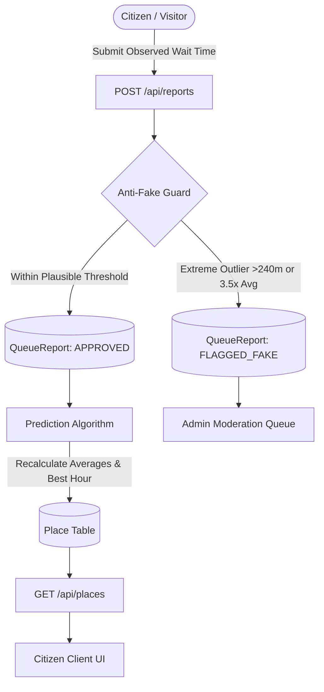
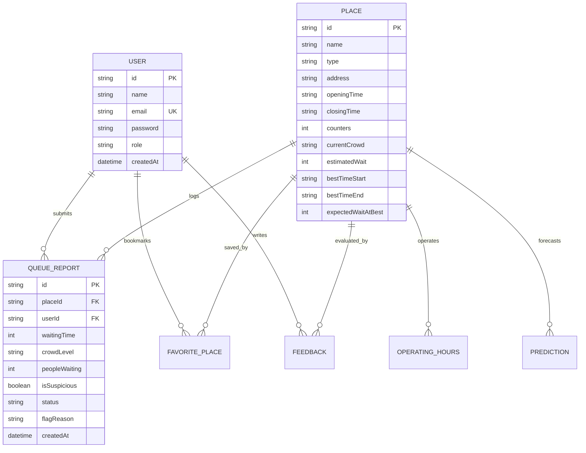

# 📄 Academic Capstone Project Report
## QueueLess – Smart Crowd & Waiting Time Prediction System

---

### Abstract
Waiting in unpredictable queues at public facilities such as hospitals, commercial banks, government administrative offices, transit hubs, and university administration departments represents a major source of lost productivity and frustration for citizens. **QueueLess** is a lightweight, responsive web and mobile application designed to estimate live crowd levels, predict real-time waiting times, and recommend the optimal hours to visit public facilities. Unlike complex machine learning systems that require heavy GPU infrastructure, QueueLess employs an efficient, pure TypeScript rolling-average prediction engine coupled with statistical outlier heuristics to filter fake or malicious reports. Built using Next.js 14, React 18, PostgreSQL, Prisma ORM, and Capacitor for native Android deployment, QueueLess delivers a complete end-to-end solution for civic queue management.

---

### 1. Introduction
Public institutions handle hundreds to thousands of citizens daily. While some facilities feature ticket dispensers, the majority lack mechanisms to communicate current queue lengths and estimated wait times to the public *before* arrival. Consequently, citizens arrive concurrently during peak hours, creating severe congestion, while other operational hours remain underutilized.

QueueLess bridges this informational gap by enabling crowdsourced waiting-time reporting and algorithmic intelligence to flatten peak arrival curves.

---

### 2. System Objectives
1. **Real-Time Crowd Visibility**: Classify public counter traffic into 4 discrete crowd levels (🟢 LOW, 🟡 MEDIUM, 🟠 HIGH, 🔴 VERY HIGH).
2. **Waiting Time Estimation**: Provide citizen-facing waiting duration estimates in minutes.
3. **Time-Slot Optimization**: Recommend the "Best Time Today" to visit with the lowest expected wait.
4. **Data Integrity & Anti-Fake Guard**: Protect against spam or absurd submissions (e.g. 500 minutes) using boundary checks and rolling variance filters.
5. **Multi-Platform Availability**: Responsive web UI accessible across mobile and desktop, packaging into an Android APK via Capacitor.

---

### 3. Software Requirements Specification (SRS)

#### 3.1 Software Requirements
* **Operating System**: Windows 10/11, macOS, or Linux
* **Runtime**: Node.js v18.0+ / v20.0+ LTS
* **Framework**: Next.js 14 (App Router)
* **Language**: TypeScript & JavaScript (ES2022)
* **Database**: PostgreSQL 14+ with Prisma ORM 5+/6+
* **Mobile Runtime**: Capacitor 7+ for Android SDK 33+

#### 3.2 Functional Modules
1. **User Authentication Module**: Citizen and administrator accounts, Bcrypt password hashing, JWT session security.
2. **Facilities Directory Module**: Search and filter public facilities by sector (Hospitals, Banks, Government, College, Railway).
3. **Crowd Reporting Module**: Interactive form for citizens to log observed wait times, active queue length, and crowd intensity.
4. **Prediction Engine Module**: Dynamic computation of expected wait times using historical rolling averages and time-of-day multipliers.
5. **Anti-Fake Moderation Module**: Heuristic identification of outlier reports with administrator verification and purging capabilities.
6. **Administrator Portal**: Facility management (create/deactivate), community metrics, and flagged report moderation.

---

### 4. System Architecture & Methodology

#### 4.1 Data Flow Diagram (DFD Level 1)

#### 4.2 Entity-Relationship (ER) Diagram

#### 4.3 Prediction & Anti-Fake Mathematical Formulations

##### A. Waiting Time Prediction:
Given a set of recent verified reports $R = \{r_1, r_2, \dots, r_n\}$ where $r_i$ denotes the waiting time in minutes:
$$\bar{T} = \frac{1}{n} \sum_{i=1}^{n} r_i$$

##### B. Crowd Level Thresholds:
$$\text{Crowd Level} = \begin{cases}
\text{LOW 🟢}, & \bar{T} \le 15\text{ mins} \\
\text{MEDIUM 🟡}, & 16 \le \bar{T} \le 30\text{ mins} \\
\text{HIGH 🟠}, & 31 \le \bar{T} \le 50\text{ mins} \\
\text{VERY HIGH 🔴}, & \bar{T} > 50\text{ mins}
\end{cases}$$

##### C. Anti-Fake Outlier Detection:
A newly submitted report $r_{\text{new}}$ is flagged if:
$$r_{\text{new}} > 240 \quad \lor \quad (r_{\text{new}} > 3.5 \cdot \bar{T} \land r_{\text{new}} - \bar{T} > 45)$$

---

### 5. Conclusion & Future Scope
QueueLess successfully provides a lightweight, highly responsive, and fault-tolerant system for tracking public queues. Future extensions may integrate IoT turnstile sensor inputs, automated token SMS notifications, and historical seasonal trend modeling.